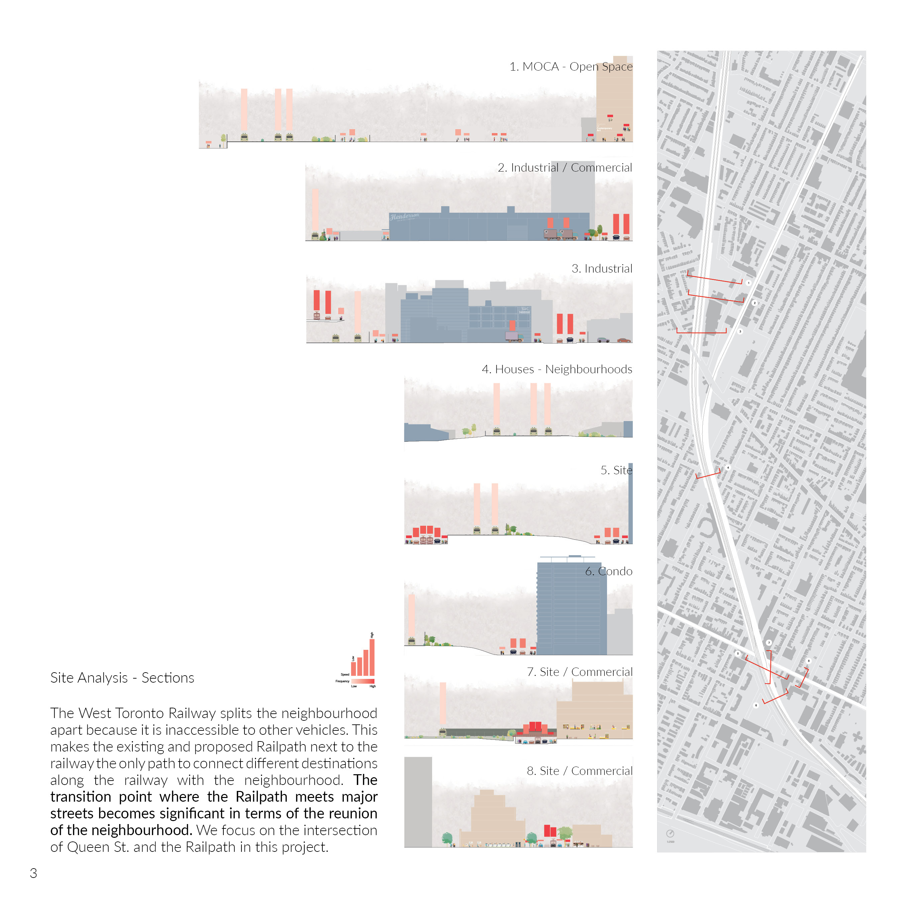
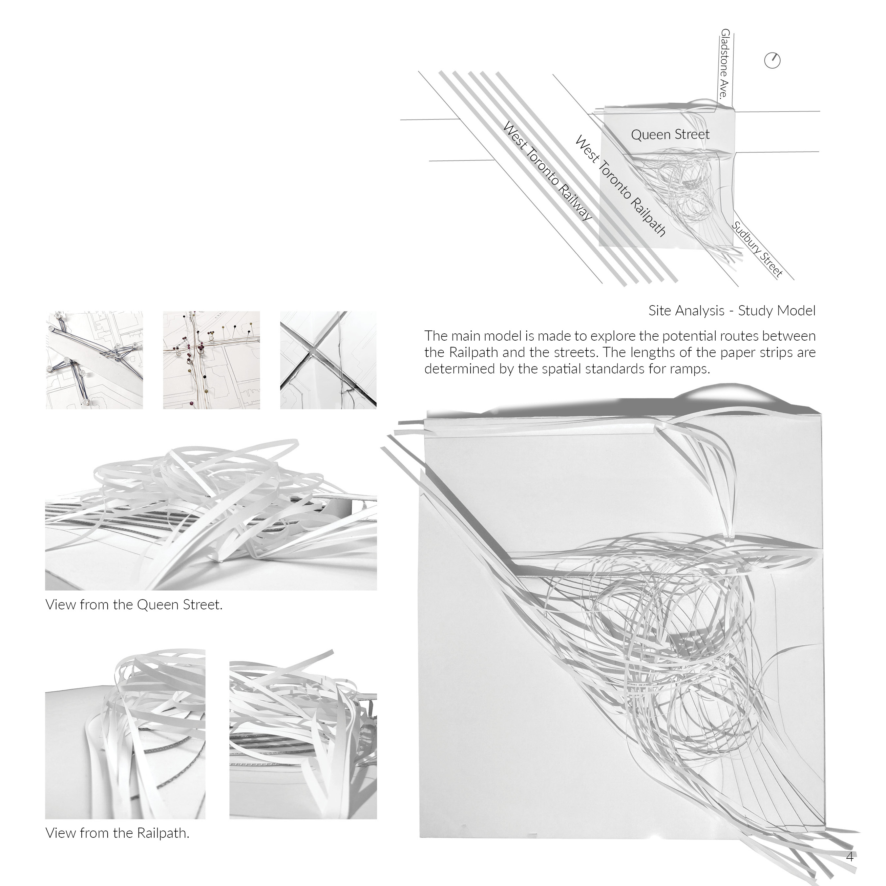
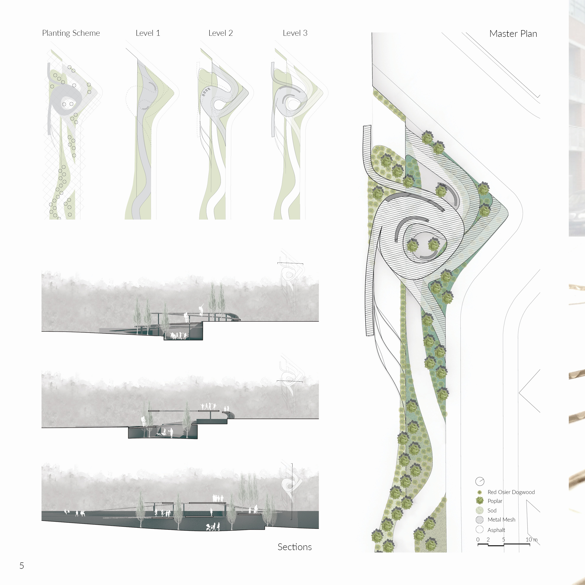
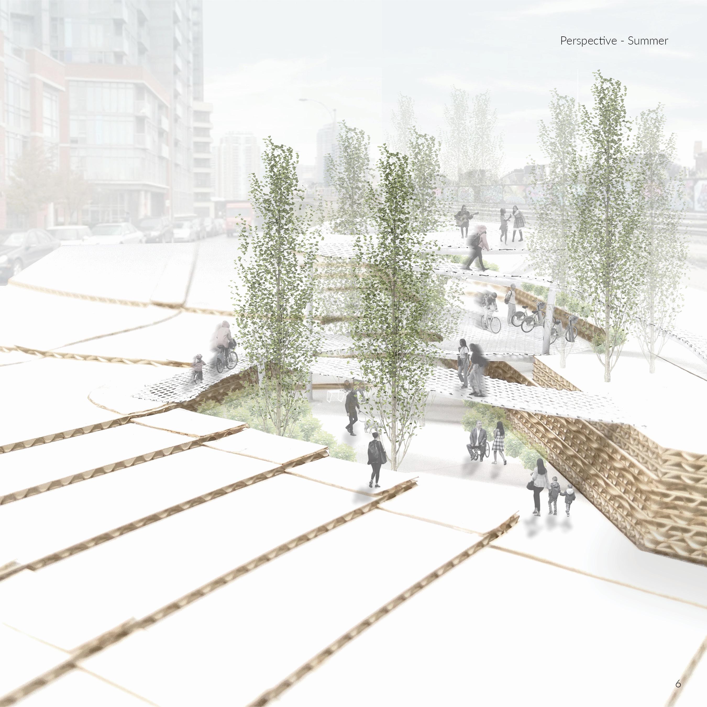
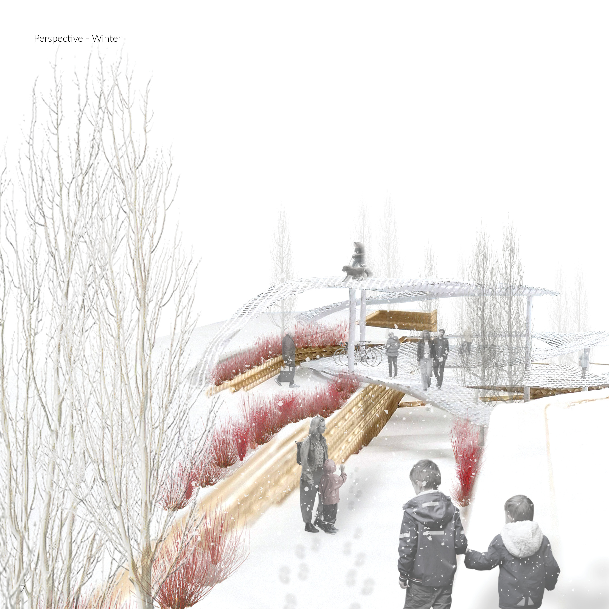
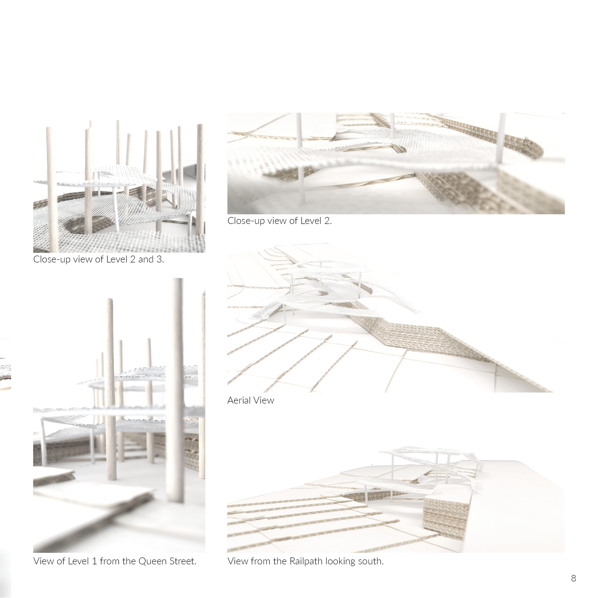

<style>
.superbigimage{
overflow-x:scroll;
white-space: nowrap;
}
.superbigimage img{
max-width: none;
}
</style>

```{r setup, include=FALSE}
knitr::opts_chunk$set(
	echo = TRUE,
	fig.align = "center",
	message = FALSE,
	warning = FALSE,
	cache = FALSE,
	results = FALSE
)
options(scipen=99)
```

- How does infrastructure re-connects the communities that are disrupted by automobile and train movements?
- How does it provide a transition between cycling- and pedestrian-friendly path and the automobile-friendly
streets?

The site lies at the intersection of the busy commercial Queen Street West and the multi-use trail, West Toronto Railpath, and I responded the above questions by constructing a structure that attracts, connects, and provides a transition point for the surrounding neighbourhood. Mesh is used to promote plant growth on
the ground level. Poplars are planted according to a grid that follows the orientation of the city street grid to form a contrast with the organic shape of the spiral structure; red osier dogwoods are used to complement with the poplars in different seasons. The bike hub connects the neighbourhood by creating easy access points for people to come and meet, recreational attractors such as the lookout platform to social and mingle, and finally, easy exit points to depart for destinations.









