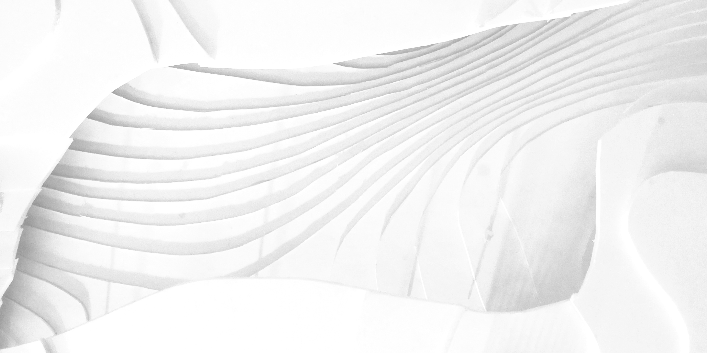
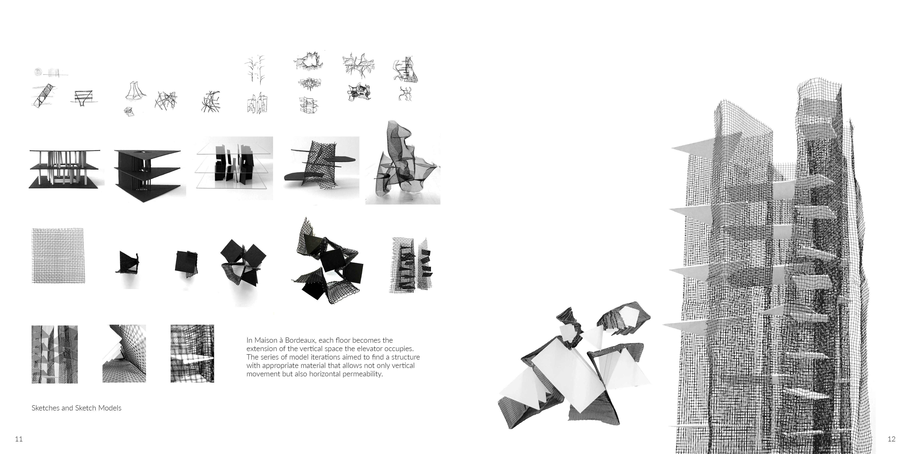
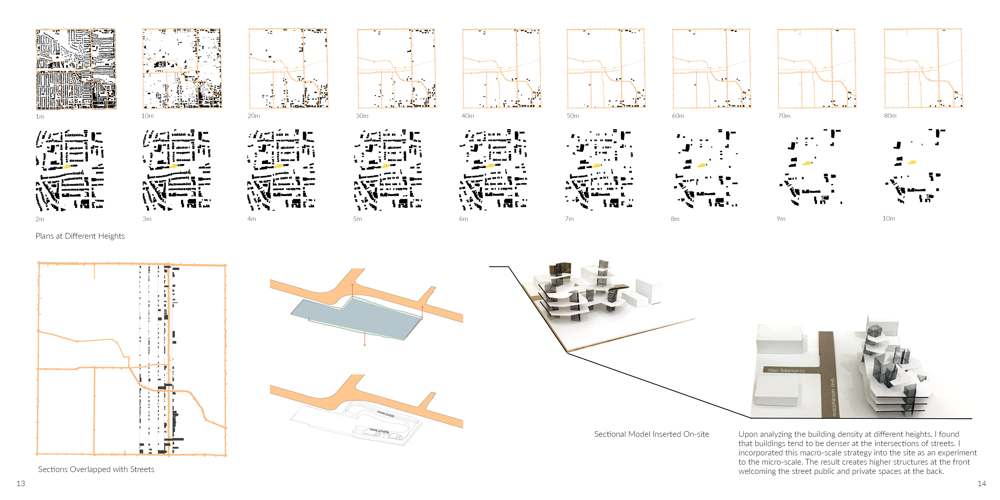
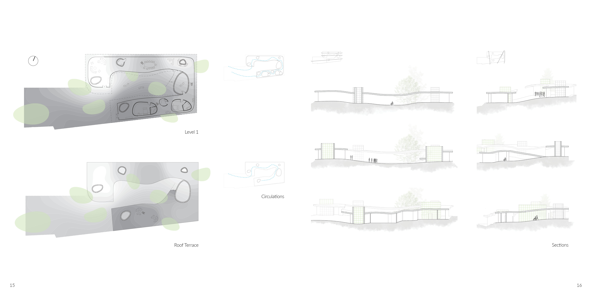
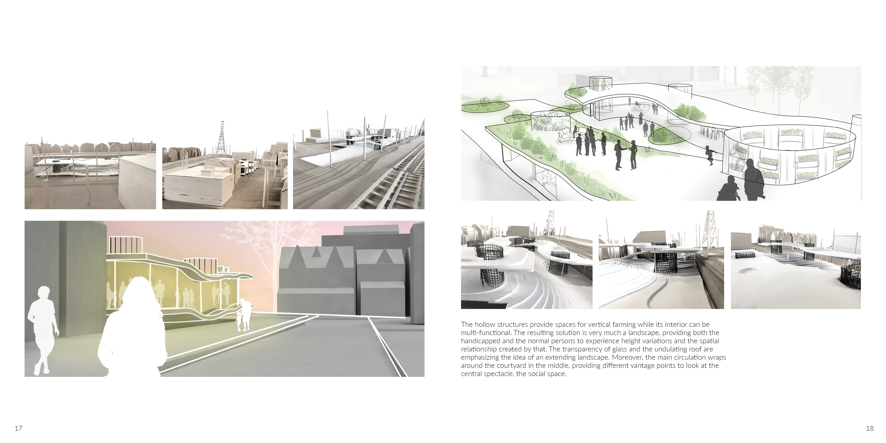

<style>
.superbigimage{
overflow-x:scroll;
white-space: nowrap;
}
.superbigimage img{
max-width: none;
}
</style>

```{r setup, include=FALSE}
knitr::opts_chunk$set(
	echo = TRUE,
	fig.align = "center",
	message = FALSE,
	warning = FALSE,
	cache = FALSE,
	results = FALSE
)
options(scipen=99)
```

- Maison à Bordeaux by OMA created a continuous experience of each level through the vertical movement of the study/elevator, how can I re-capture this relationship by extending the experience on a single level for a wheelchair user?

In this project, I first analyzed Maison à Bordeaux by exploring the relationship with verticality and horizontal layers through drawings and models, which informs the structural elements in the final project. 

Later on, the height differences of existing buildings on the site in relation to urban edges are investigated, which informs the level change of the housing terrain. Finally, how a house can function upon an undulating terrain is explored. With the clients be a wheelchaired engineer and a socialite interested in urban farming, the main circulation wraps around the middle courtyard, providing easy access for the wheelchair user and different vantage points to look at the central spectacle, the social space, forming a reversal to the spatial relationship in Maison à Bordeaux.







