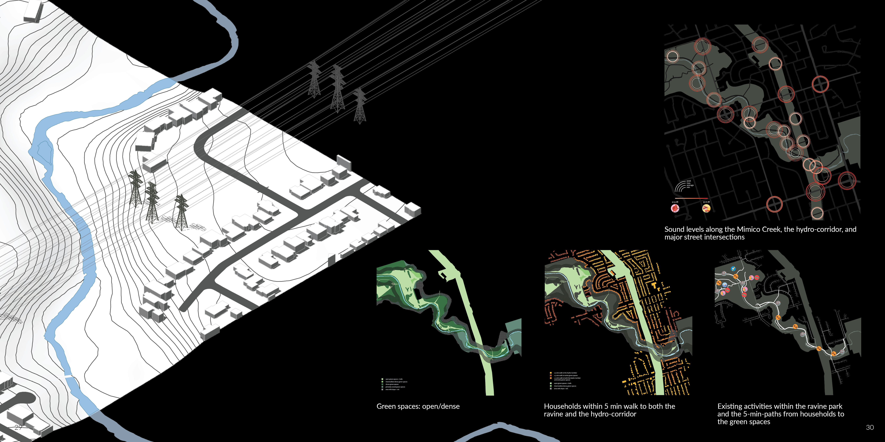
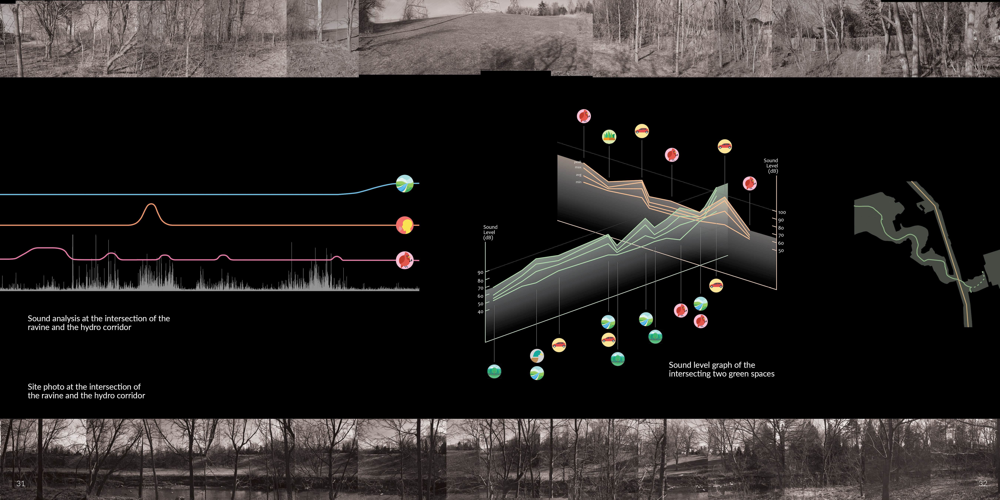

<style>
.superbigimage{
overflow-x:scroll;
white-space: nowrap;
}
.superbigimage img{
max-width: none;
}
</style>

```{r setup, include=FALSE}
knitr::opts_chunk$set(
	echo = TRUE,
	fig.align = "center",
	message = FALSE,
	warning = FALSE,
	cache = FALSE,
	results = FALSE
)
options(scipen=99)
```

- How do natural ravine and man-made hydro corridor affect the surrounding neighbourhoods?

I explored this through a thorough study of North Etobicoke region near the Mimico Creek in regards to the residential accessibility to the natural ravine and artificial hydro-corridor as well as the effect of vegetation barrier on sound levels. Through careful data collection, I found the noise levels are relatively high at where the ravine meets the major street.






