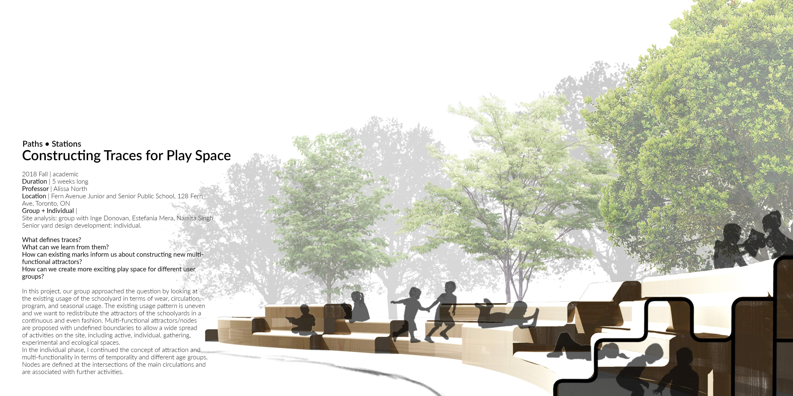
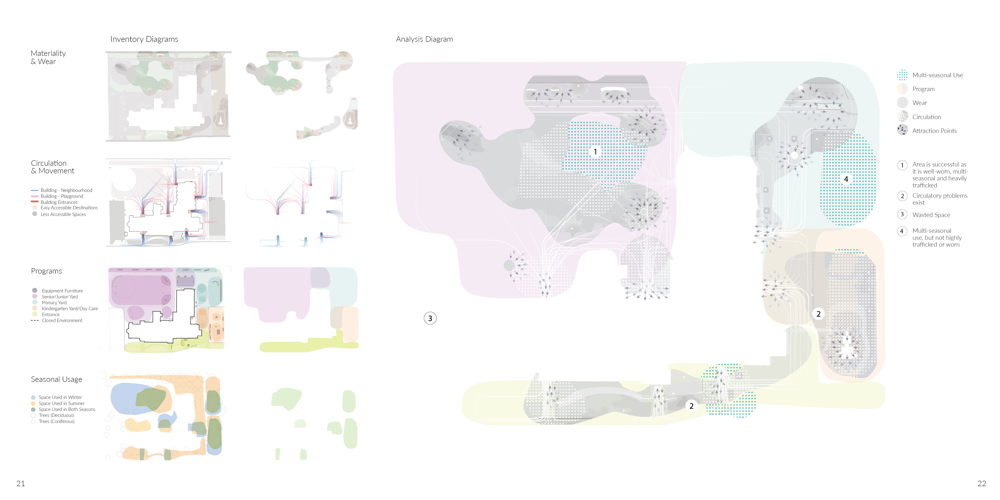
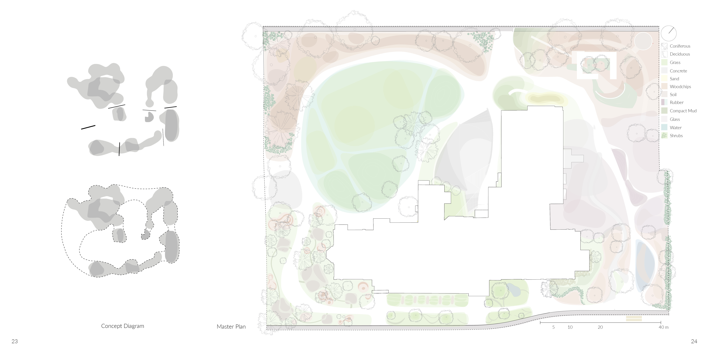
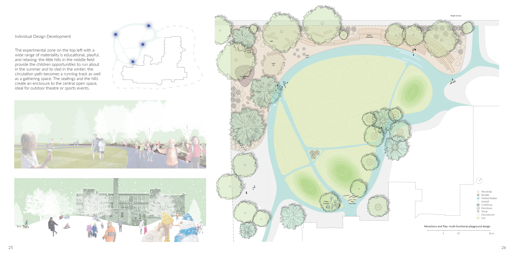

<style>
.superbigimage{
overflow-x:scroll;
white-space: nowrap;
}
.superbigimage img{
max-width: none;
}
</style>

```{r setup, include=FALSE}
knitr::opts_chunk$set(
	echo = TRUE,
	fig.align = "center",
	message = FALSE,
	warning = FALSE,
	cache = FALSE,
	results = FALSE
)
options(scipen=99)
```

- What defines traces?
- What can we learn from them?
- How can existing marks inform us about constructing new multifunctional attractors?
- How can we create more exciting play space for different user groups?

In this project, our group approached the question by looking at the existing usage of the schoolyard in terms of wear, circulation, program, and seasonal usage. The existing usage pattern is uneven and we want to redistribute the attractors of the schoolyards in a continuous and even fashion. Multi-functional attractors/nodes are proposed with undefined boundaries to allow a wide spread of activities on the site, including active, individual, gathering, experimental and ecological spaces. In the individual phase, I continued the concept of attraction and multi-functionality in terms of temporality and different age groups. Nodes are defined at the intersections of the main circulations and are associated with further activities.







